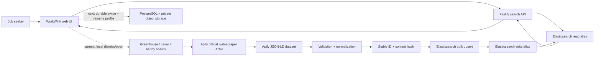
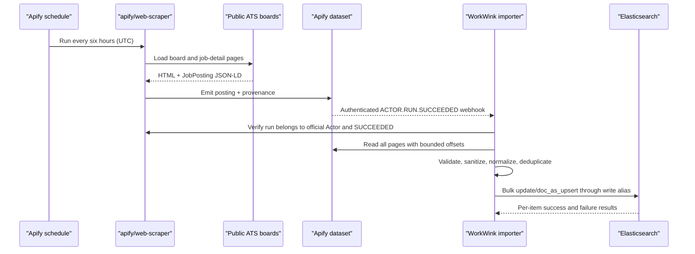
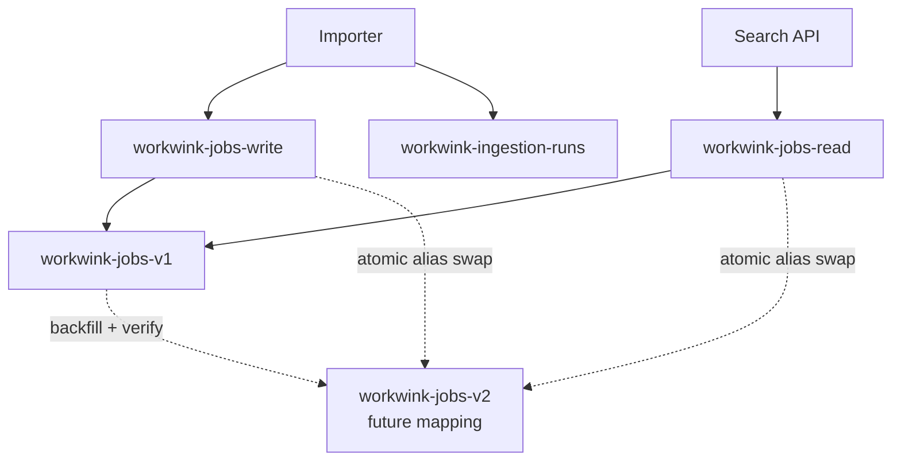
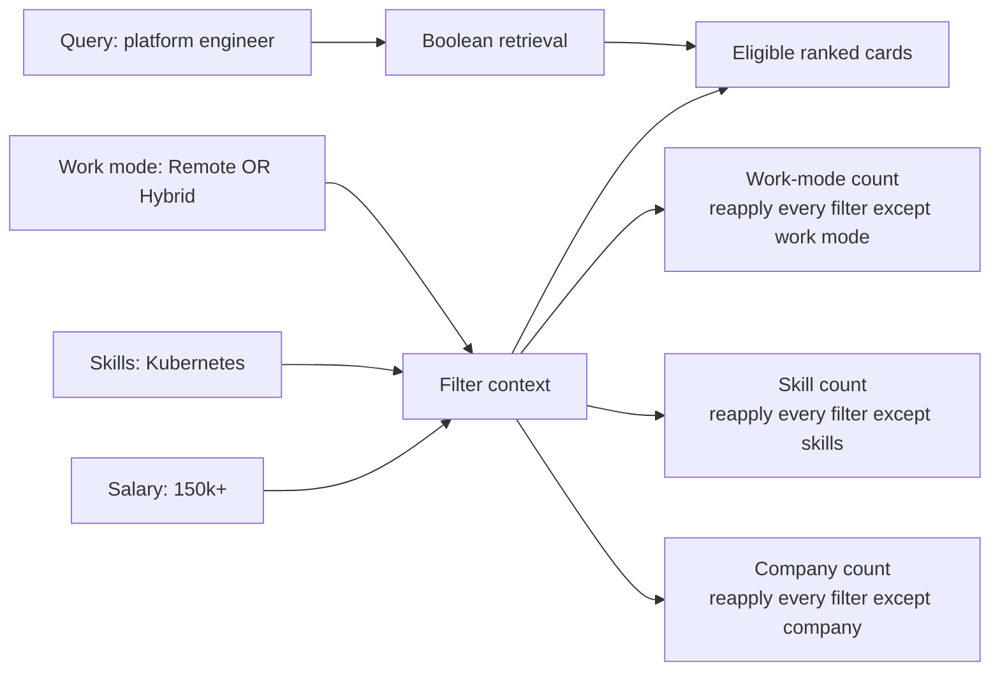

# WorkWink Architecture

**Product line:** Swipe into work worth wanting.  
**Hackathon proof:** real web data enters through an Apify-maintained Actor, becomes a typed Elasticsearch search projection, and powers a fast, filterable job-card experience without runtime demo data.

## Executive summary

WorkWink turns public company career boards into a fresh job-discovery feed. Apify's official `apify/web-scraper` Actor crawls configured Greenhouse, Lever, and Ashby boards. A browser-side page function extracts `JobPosting` JSON-LD plus provenance. WorkWink retrieves the Actor dataset with the official Apify client, validates and normalizes each record, derives a stable identity and content hash, and bulk-upserts accepted jobs through an Elasticsearch write alias.

The web application sends every search and filter change to Elasticsearch. Exact constraints run in filter context, free text uses boosted lexical fields, and an optional `semantic_text` field enables semantic retrieval when an inference endpoint is configured. Elasticsearch also computes the facet counts shown beside filters. The UI debounces requests for 150 ms, aborts superseded searches, stores filter state in the URL, and keeps pagination stable with a signed `search_after` cursor.

For the sponsor demo, a PDF résumé is parsed in memory with PDF.js and immediately discarded. The browser receives only a compact profile containing skills with page/offset evidence, inferred target roles, and Austin/remote/hybrid preferences. Match scores remain deterministic and explainable. Separately, Elasticsearch's native NVIDIA inference service calls `workwink-nemotron` to generate dating-profile-style job summaries. The response is schema-validated, evidence quotes are checked against source text, and successful results are cached by job ID and source content hash. Nemotron never overwrites authoritative title, employer, location, salary, source URL, or filter fields.

This document separates what is implemented from the reviewed startup architecture. The live integration spine, PDF résumé profile, session match score, and Nemotron card enrichment are real. Account creation, persistent swipes, learned ranking, and application-package generation are the next product layer.

## Status at a glance

| Capability | Status | Evidence in the project |
|---|---|---|
| Official Apify Actor only | Implemented | `OFFICIAL_WEB_SCRAPER_ACTOR_ID = "apify/web-scraper"`; other Actor IDs are rejected |
| Greenhouse, Lever, and Ashby crawl input | Implemented | Supported-host allowlist and provider-aware page function |
| JSON-LD extraction with provenance | Implemented | Dataset records contain `jobPosting`, source URLs, provider, Actor, and extraction timestamps |
| Dataset pagination | Implemented | Bounded `listItems()` loop reads all pages through `apify-client` |
| Six-hour Apify schedule | Implemented as provisioning code | `0 */6 * * *` UTC schedule, enabled and exclusive |
| Automatic run-completion webhook | Implemented as provisioning and server code | Provisioning registers `ACTOR.RUN.SUCCEEDED`; the authenticated route re-verifies the run through Apify before import |
| Validation, normalization, and stable deduplication | Implemented | Canonical schema, stable `jobId`, `contentHash`, sanitation, salary conversion, skill extraction |
| Versioned job index plus read/write aliases | Implemented | `workwink-jobs-v1`, `workwink-jobs-read`, `workwink-jobs-write` |
| Idempotent upsert by canonical job ID | Implemented | Bulk `update` with `doc_as_upsert` and stable Elasticsearch `_id` |
| Ingestion run ledger | Implemented in Elasticsearch | Separate strict ingestion-runs index; completed runs return without reimport |
| Lexical search and exact filters | Implemented | Boosted multi-field query plus filter-context clauses |
| Optional semantic search | Implemented behind configuration | `semantic_text` mapping and semantic query require an explicit inference endpoint |
| RRF fusion | Planned, not implemented | Current hybrid mode uses lexical and semantic clauses in one Boolean query |
| Disjunctive filter aggregations | Implemented for structured filters | Each facet count excludes only its own selection |
| Query-aware disjunctive counts | Gap | Current facet aggregations do not reapply the free-text query inside their global scope |
| Signed cursor pagination | Implemented | HMAC-bound query fingerprint plus `search_after` tuple, valid for 24 hours |
| Point-in-time pagination | Planned, not implemented | Current cursor does not hold an Elasticsearch PIT, so concurrent index updates can shift later pages |
| Fast filter and swipe-card UI | Implemented | 150 ms debounce, request cancellation, URL state, counts, empty/error/degraded states |
| Secure PDF résumé profile | Implemented | Multipart upload, 5 MiB/12-page limits, in-memory PDF.js extraction, evidence spans, no raw résumé storage |
| Evidence-backed match score | Implemented for the live session | Deterministic skill, target-role, and work-mode components; persistent learning remains next |
| Nemotron profiles through Elastic | Implemented | Native Elastic NVIDIA inference, strict response schema, evidence validation, content-hash cache index |
| Durable right-swipe queue | Implemented | Strict Elastic index, signed HttpOnly session isolation, immutable job snapshot, idempotent `(session, job)` identity |
| Approval workflow | Implemented through approval | Optimistic-concurrency state machine prevents skipping package review and approval states |
| Automatic application dispatch | Actor scaffold only | Private Apify Actor is approval-gated; account/private résumé storage and internal lease endpoints are required before dispatch |

## Product experience

The current hackathon slice proves the live discovery loop:

1. The operator configures public company job-board URLs.
2. Apify runs the official Web Scraper Actor and creates a real dataset.
3. WorkWink imports, normalizes, deduplicates, and indexes the jobs.
4. A user searches by role, skill, or company and filters by work mode, seniority, title family, skills, company, posted age, and compensation.
5. Elasticsearch returns cards, counts, freshness, highlights, and provenance.
6. The user swipes left to dismiss or right to open the real application page.

The startup product extends the same spine with an account, resume evidence, persistent preference state, evidence-backed match components, saved jobs, and a human-approved application package. Those user-specific capabilities belong in PostgreSQL and private object storage. They should not be presented as complete in this build.



## Apify collection architecture

### Why `apify/web-scraper`

The integration deliberately accepts only `apify/web-scraper`, an Apify-maintained Actor. This satisfies the constraint that the available credits apply to Apify Actors rather than community-built job scrapers. WorkWink rejects a configured Actor ID that does not equal `apify/web-scraper`.

The Actor receives a generated input instead of a hand-maintained dataset. Start URLs must use HTTPS and belong to one of four allowed hosts:

- `boards.greenhouse.io`
- `job-boards.greenhouse.io`
- `jobs.lever.co`
- `jobs.ashbyhq.com`

The input respects `robots.txt`, disables media and CSS downloads, uses the Actor-required Apify Proxy configuration, limits crawl depth to one, retries failed requests twice, and bounds pages, results, concurrency, and execution time. These controls keep a schedule predictable and prevent a malformed board from creating an unbounded crawl.

### Crawl and extraction behavior

The Actor executes WorkWink's `pageFunction` inside the official browser runtime:

1. Identify the provider from the loaded hostname.
2. Scan anchors and enqueue provider-specific job-detail links only; for Ashby listing pages, also traverse the server-rendered `window.__appData` inventory to discover UUID detail routes that are not rendered as anchors.
3. Ignore application endpoints and unsupported hosts.
4. Parse every `<script type="application/ld+json">` element.
5. Walk arrays and `@graph` nodes to locate Schema.org `JobPosting` objects.
6. Deduplicate repeated JSON-LD objects on the same page.
7. Emit one dataset record per posting with the original JSON-LD and crawl provenance.

Each emitted dataset item keeps enough evidence to trace a card back to collection:

```text
sourceActor, provider, sourceUrl, scrapedAt,
requestedUrl, loaded page URL, canonical URL,
discoveredFrom, JSON-LD script index, JobPosting payload
```

WorkWink then uses `apify-client` to read the dataset in bounded pages. It increments the offset by the number of returned items and stops only when the total has been reached or the Actor returns an empty page. It does not assume that one API response contains the full crawl.

### Six-hour schedule

`pnpm apify:schedule` creates or updates an enabled, exclusive UTC schedule named `workwink-six-hour-job-scrape`:

```text
0 */6 * * *
```

That expression triggers four refreshes each day. The schedule runs the official Actor with the same validated board input and production limits. The code can update an explicitly configured schedule ID or discover an existing schedule by name, which prevents duplicate schedules during repeated setup.

`pnpm apify:task` similarly creates or updates the saved `workwink-sponsor-job-scraper` Task. The Task is bound to the official Actor and refuses to overwrite a same-named task belonging to any other Actor. This gives judges a one-click Apify Console demonstration while preserving the same reviewed inputs used by the API and schedule.

When both `APIFY_WEBHOOK_URL` and `APIFY_WEBHOOK_SECRET` are configured, the schedule provisioner also creates or updates a persistent `ACTOR.RUN.SUCCEEDED` webhook. Apify sends the secret in a dedicated header. The Fastify callback uses constant-time secret comparison, extracts the run ID, and invokes the same idempotent importer. The importer does not trust the callback alone: it fetches the run through Apify, verifies `SUCCEEDED`, verifies the official Actor identity, and then reads the referenced dataset. Without a deployed webhook URL, operators can still import through `pnpm ingest:run -- <RUN_ID>` or the protected admin endpoint.



## Normalization and deduplication

Raw web data is untrusted and inconsistent. WorkWink converts every accepted item into a strict `CanonicalJob` before Elasticsearch sees it.

The normalizer:

- strips HTML from descriptions and requirements;
- rejects records without a valid source URL, application URL, title, company, or description;
- normalizes employment type, industry, location, work mode, seniority, and title family;
- recognizes a curated set of technical skills from the posting text;
- converts hourly, daily, weekly, and monthly compensation into comparable annual values;
- preserves the original compensation text when available;
- derives active or closed status from explicit expiry fields;
- records collection and verification timestamps;
- validates the result with a strict Zod contract.

Deduplication uses two hashes with different jobs:

| Field | Purpose | Construction |
|---|---|---|
| `jobId` | Stable canonical identity and Elasticsearch `_id` | SHA-256 of source host plus source job ID when present; otherwise company, title, location, and apply URL. Stored as 32 hexadecimal characters. |
| `contentHash` | Detect a meaningful content version | SHA-256 of normalized title, company, location, work mode, employment type, description, requirements, salary, dates, and apply URL. Stored as 64 hexadecimal characters. |

Bulk ingestion uses `update` plus `doc_as_upsert` against the write alias. Replaying the same successful run is a no-op because the ingestion ledger is keyed by Actor run ID. Re-seeing the same role in a new run updates the stable document instead of creating another result.

Current limitation: Elasticsearch is serving both as the retrieval projection and the ingestion ledger. The reviewed startup architecture moves canonical job history and queue state into PostgreSQL, leaving Elasticsearch rebuildable. Cross-source fuzzy deduplication and absence-based closure across complete runs are also planned, not implemented.

## Elasticsearch architecture

### Versioned indexes and aliases

The current backing index is versioned:

```text
workwink-jobs-v1
```

Two aliases isolate callers from that concrete name:

```text
workwink-jobs-read   -> search API
workwink-jobs-write  -> bulk importer (is_write_index: true)
```

The setup command creates the strict mapping, attaches both aliases, and creates `workwink-ingestion-runs`. Code always searches the read alias and bulk-writes through the write alias with `require_alias: true`. That last guard prevents an accidental typo from silently creating an unmanaged concrete index.

Versioning lets a later mapping change build `workwink-jobs-v2`, backfill it, validate counts and representative searches, then atomically move aliases. The current setup code will move aliases to the version compiled into the application, but it does not yet implement the full backfill-and-verify migration workflow.



### Mapping choices

The mapping is `dynamic: strict`, so schema drift fails visibly instead of creating surprise fields. WorkWink deliberately does not set shard or replica counts: Elastic Serverless owns topology, while self-managed deployments may apply those values through deployment policy.

| Data shape | Elasticsearch type | Why |
|---|---|---|
| `title`, `companyName`, `location` | `text` plus a lowercase `keyword` subfield | Full-text relevance and exact filtering/sorting from one canonical value |
| `description`, `requirements`, `searchText` | `text` with the standard analyzer | Lexical search and highlighted evidence passages |
| `workMode`, `seniority`, `titleFamily`, `skills`, `industries`, `employmentType`, status | lowercase-normalized `keyword` | Fast exact filters and terms aggregations using doc values |
| salary bounds | `scaled_float` with scale 100 | Exact numeric range filters without floating-point drift |
| posting, collection, verification, and expiry times | `date` | Freshness filters, sorting, and lifecycle checks |
| source/apply URLs and original salary text | stored but not indexed | Return provenance without wasting inverted-index or doc-value space |
| optional `semanticText` | `semantic_text` bound to `ELASTICSEARCH_INFERENCE_ID` | Let Elastic create and query semantic chunks through an explicitly configured inference endpoint |

`semanticText` is populated from the combined normalized `searchText` only when an inference endpoint ID is configured. With `ELASTIC_SEARCH_MODE=lexical`, the application needs no semantic inference. With `ELASTIC_SEARCH_MODE=hybrid`, startup validation requires the inference ID.

### Lexical and hybrid retrieval

Lexical search uses a Boolean query with:

- an exact phrase boost on title;
- a boosted `multi_match` across title, title family, skills, company, requirements, description, and combined search text;
- `operator: and` plus automatic fuzziness;
- all structured constraints in filter context.

Current hybrid mode adds a semantic query over `semanticText` beside the lexical clause and requires at least one to match. If that hybrid request fails, WorkWink reruns the request in lexical mode and sets `degraded: true` so the UI can label the fallback.

The reviewed design calls for two independently ranked candidate lists combined with reciprocal rank fusion (RRF). RRF merges ranks rather than trying to compare incompatible BM25 and semantic scores. It is not implemented in the current code. For the demo, describe the current mode as a lexical-plus-semantic Boolean hybrid with a real lexical fallback, not as RRF.

### Filters and aggregations

Structured filters support:

- work mode;
- seniority;
- title family;
- skills;
- company;
- employment type;
- industry;
- minimum normalized annual compensation;
- whether unknown compensation may remain eligible;
- posting age;
- active lifecycle status.

Values inside one facet are ORed with a terms query. Different facets are ANDed because they enter the Boolean filter array together. A minimum salary matches `salary.annualMax >= minimumSalary`; missing salary is eligible only when `includeUnknownSalary` is true.

Facet counts use disjunctive aggregation. For each facet, Elasticsearch opens a global aggregation, reapplies every structured filter except that facet's own selection, then runs a terms aggregation. This keeps useful alternatives visible. For example, selecting Remote does not force the Hybrid count to zero.

Current limitation: because the facet aggregation uses a global scope and only reapplies structured filters, free-text query relevance is not part of the facet-count universe. The next revision should reapply the lexical or hybrid query alongside the self-excluding filters.



### Pagination and response shape

Search sorts are deterministic:

- relevance: `_score`, then `postedAt`, then `jobId`;
- newest: `postedAt`, then `jobId`;
- salary: `salary.annualMax`, then `postedAt`, then `jobId`.

The final `jobId` tie-breaker makes `search_after` stable when earlier sort values match. WorkWink returns the last sort tuple inside an opaque cursor. The cursor also binds the complete request without its cursor, the retrieval mode, and its issue time. An HMAC signature prevents clients from editing any of those values. Cursors expire after 24 hours and changing a filter invalidates the old cursor.

This avoids deep `from/size` pagination, but it is not yet a full point-in-time cursor. A PIT would freeze the index view across pages and should be added before high-write production use.

Each response contains:

```text
items, total, facets, nextCursor,
mode, degraded, dataFreshness, tookMs
```

Each card also carries source and application URLs, collection timestamps, normalized fields, score, and highlighted snippets. The API excludes the generated semantic field from `_source` to keep payloads smaller.

## Fast UI filters powered by Elasticsearch

The browser does not filter a downloaded array. It sends a typed request to `/api/search/jobs`, and Elasticsearch evaluates both eligibility and counts.

The interaction loop is designed for perceived speed:

1. Change a chip, input, range, or sort option.
2. Wait 150 ms to combine rapid input changes.
3. Abort the previous in-flight request.
4. Write the current filter state to the URL.
5. Render Elasticsearch cards and counts from the newest response only.
6. Show an explicit empty, unavailable, or degraded state when appropriate.

The UI currently renders work-mode and seniority counts beside chips. The API already returns title family, skills, company, employment type, and industry buckets, so those controls can become count-backed selectors without another backend contract.

## Failure and degradation paths

| Failure | Current behavior | Production completion |
|---|---|---|
| Apify run fails | Import rejects any run not in `SUCCEEDED` status | Schedule alert and retry policy; never age jobs from an incomplete run |
| Run belongs to another Actor | Import rejects it after resolving the official Actor ID | Keep the same independent verification in the webhook path |
| Malformed dataset item | Item is quarantined in the run result; other valid items continue | Durable dead-letter records and schema-drift alerting |
| Duplicate completed run | Import returns the stored completed result | PostgreSQL unique constraint and worker idempotency key |
| Partial Elastic bulk failure | Item-level failures are returned and run status becomes partial | Retry failed items with backoff; expose replay tooling |
| Elasticsearch unavailable | API returns a typed server error and UI shows “The signal dropped” | Alerting, readiness checks, and bounded stale-cache policy if desired |
| Semantic request/inference fails | Search retries once in lexical mode and labels the response degraded | Circuit breaker and separate semantic health probe |
| Empty eligible set | UI shows a real zero-results state and does not inject fake jobs | Keep this behavior |
| Stale UI request | Browser aborts it; serial guard ignores late responses | Keep this behavior |
| Tampered/expired cursor | API rejects it with `INVALID_CURSOR` | Add a typed restart response when PIT support lands |
| Index changes between pages | `search_after` can observe a shifted result set | Add point-in-time pagination |

## Security and trust boundaries

- Apify and Elasticsearch credentials remain server-side and are loaded from environment variables.
- The Apify client uses token authentication; credentials are never printed by the run command.
- Only HTTPS URLs on an explicit ATS host allowlist can enter the crawler.
- Scraped HTML is sanitized into plain text before storage and rendering.
- Elasticsearch mappings are strict and search request fields have explicit limits.
- The API exposes no raw Query DSL escape hatch.
- Administrative ingestion requires a timing-safe bearer or `x-admin-token` comparison and is rate-limited.
- Search is rate-limited and CORS is closed in production.
- Cursor signatures bind pagination state to the search request.

Before outside-user release, WorkWink still needs account-level authorization, private resume storage, malware scanning, deletion/export controls, durable audit records, and source-terms review.

## Why this fits the hackathon

**Creative:** the product turns live search infrastructure into a low-friction preference interface rather than another list of links.

**Complete:** the visible path connects an Apify-maintained Actor to a real dataset, typed normalization, Elasticsearch indexing, search, aggregations, filters, and source-linked cards. There is no runtime fake-data branch.

**Technically clear:** Apify owns fresh web collection and scheduling. Elasticsearch owns retrieval, exact filtering, aggregations, highlights, semantic capability, and pagination. WorkWink owns schema enforcement, provenance, UX, and explicit degradation.

The highest-value demo trace is:

```text
Actor run ID
  -> Apify dataset ID
  -> canonical WorkWink job ID
  -> Elasticsearch document ID
  -> search hit + facet bucket
  -> rendered card + original source URL
```

## 90-second presentation talk track

> Job seekers do not have a shortage of job links. They have a freshness and decision problem. WorkWink is a swipeable job feed built on real web data, not a demo dataset.
>
> Every six hours, an Apify schedule runs Apify's official Web Scraper Actor against configured Greenhouse, Lever, and Ashby company boards. Our page function follows only job-detail links and extracts Schema.org JobPosting JSON-LD with the page URL, canonical URL, provider, Actor, and collection time. We retrieve every dataset page through the official Apify client.
>
> Before search, WorkWink strips unsafe HTML, validates a strict schema, normalizes salary and work mode, extracts skills, and derives a stable job ID. Repeated runs update the same role instead of creating duplicates. Accepted jobs are bulk-upserted through an Elasticsearch write alias into a versioned index.
>
> The experience is powered directly by Elasticsearch. A search combines boosted lexical fields, optional semantic text, exact filters, highlights, freshness, and disjunctive aggregations. That means selecting Remote still shows meaningful counts for Hybrid and On-site. The browser debounces every filter change, cancels stale requests, and uses a signed search-after cursor.
>
> Today the live integration and fast-filter feed work. The next layer persists swipes, scores a real resume with evidence, and generates a human-approved application package. Apify supplies the fresh market signal; Elasticsearch turns it into an explainable decision engine.

## Presenter guardrails

- Say **“official Apify Web Scraper Actor”**, not “our custom Actor.” The extraction function is our Actor input, but the runtime Actor is `apify/web-scraper`.
- Say **“the schedule and success-webhook path are implemented.”** Claim that a webhook is actively registered only after a public deployment URL is configured and provisioning has succeeded.
- Say **“lexical-plus-semantic hybrid with lexical fallback.”** Do not say RRF until two ranked lists are actually fused.
- Say **“signed search-after cursor.”** Do not say PIT pagination until a point-in-time ID is carried in the cursor.
- Say **“swipeable discovery feed.”** Do not claim learned swipe personalization, accounts, resume scoring, or generated applications are complete in this build.
- Show the run ID, dataset ID, indexed count, source URL, query time, and facet counts. Those are the strongest proof that both sponsor technologies are doing real work.

## Code map for technical questions

| Concern | Source |
|---|---|
| Official Actor input and JSON-LD extraction | `src/apify/web-scraper-input.ts` |
| Actor execution, dataset paging, schedule provisioning | `src/integrations/apify.ts` |
| Canonical contract and search request/response schema | `src/contracts/job.ts` |
| Normalization, sanitation, salary conversion, IDs and hashes | `src/domain/normalize.ts` |
| Versioned index, aliases, mappings, bulk writes, capability checks | `src/integrations/elastic.ts` |
| Run verification, import ledger, item rejection, bulk result handling | `src/services/ingestion.ts` |
| Queries, filter context, aggregations, fallback, cursor | `src/services/search.ts` |
| Search HTTP contract and rate limit | `src/routes/search.ts` |
| Protected manual ingestion | `src/routes/admin.ts` |
| Fast filter and card interaction | `web/app.js` |
| Credentialed end-to-end trace | `scripts/smoke-live.ts` |
